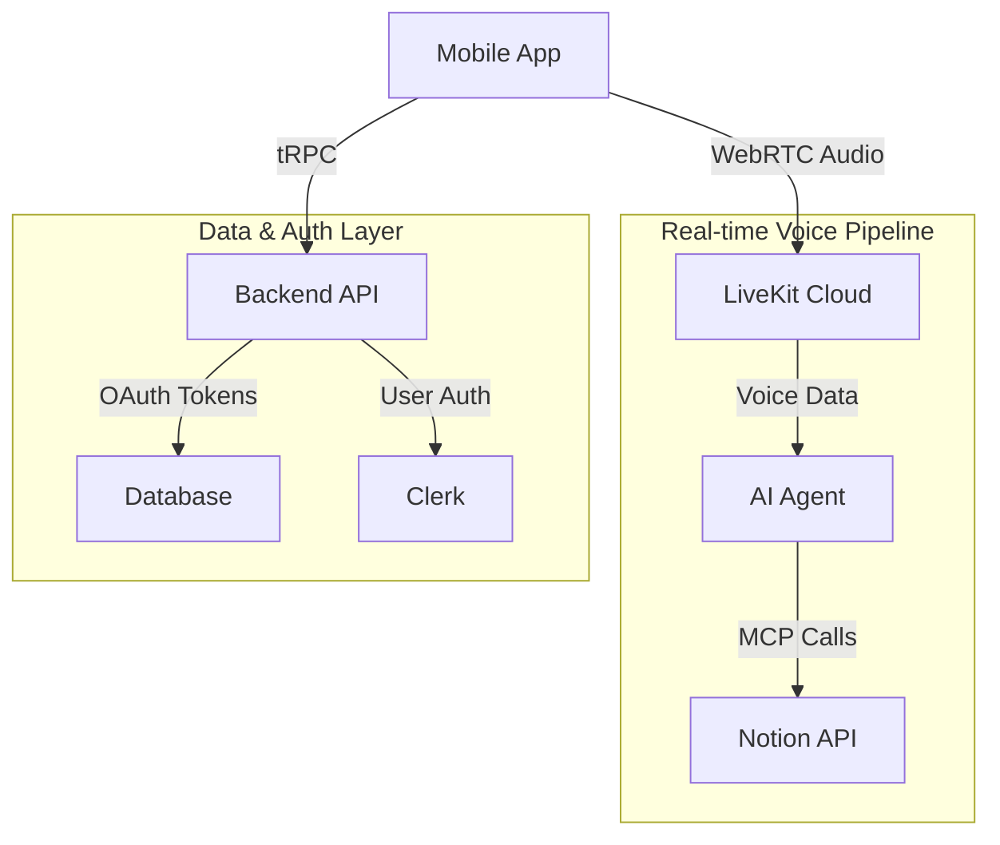

# Voice-Powered Notion Assistant

A modern monorepo application that provides an AI-powered voice assistant for managing Notion workspaces through natural conversation. The system combines real-time voice interaction with intelligent Notion integration to streamline productivity workflows.

## 🚀 Key Capabilities

### Voice-First Interaction

- **Real-time Voice Chat**: Natural conversation with an AI assistant using OpenAI's Realtime API
- **Semantic Voice Activity Detection**: Intelligent turn-taking and interruption handling
- **Enhanced Audio Processing**: LiveKit-powered audio with noise cancellation
- **Cross-Platform Support**: Native mobile experience with web fallback

### Notion Integration

- **Workspace Management**: Create, read, update, and organize Notion pages and databases
- **Intelligent Summarization**: AI-powered content summaries instead of verbose read-outs
- **OAuth Security**: Secure authentication with Notion using PKCE flow
- **MCP Protocol**: Modern integration using Model Context Protocol for extensible tool usage

### User Experience

- **Mobile-First Design**: Optimized for iOS and Android with Expo
- **Authentication Flow**: Seamless user onboarding with Clerk authentication
- **Visual Feedback**: Real-time audio visualization during conversations
- **Offline-Ready**: Robust error handling and connection management

## 🏗️ High-Level Architecture

### Monorepo Structure

```
gmailAI/
├── apps/
│   ├── mobile/          # React Native/Expo mobile application
│   ├── backend/         # Next.js API server with tRPC
│   └── agent/           # Python voice AI agent
├── shared assets/       # Common configurations and types
└── deployment configs/  # Docker, Render.com setup
```

### Technology Stack

#### Mobile Application (`apps/mobile/`)

- **Framework**: React Native with Expo SDK 53
- **Navigation**: Expo Router for file-based routing
- **Styling**: NativeWind (Tailwind CSS for React Native) [[memory:2264505]]
- **Real-time Communication**: LiveKit React Native SDK
- **State Management**: TanStack Query + tRPC client
- **Authentication**: Clerk for user management
- **Development**: TypeScript, ESLint, Prettier

#### Backend API (`apps/backend/`)

- **Framework**: Next.js 15 with App Router
- **API Layer**: tRPC for end-to-end type safety
- **Database**: PostgreSQL with Drizzle ORM
- **Authentication**: Clerk integration with JWT validation
- **Real-time**: LiveKit server SDK for voice sessions
- **External Integrations**: Notion OAuth, Stripe payments
- **Deployment**: Vercel-ready configuration

#### AI Agent (`apps/agent/`)

- **Runtime**: Python with asyncio
- **AI Model**: OpenAI Realtime API with voice capabilities
- **Voice Processing**: LiveKit agents framework
- **Tool Integration**: MCP (Model Context Protocol) for Notion
- **Audio Enhancement**: Noise cancellation and voice activity detection
- **Deployment**: Docker containerization for Render.com

### Data Flow Architecture



### Security & Authentication

1. **User Authentication**: Clerk handles user registration, login, and session management
2. **API Security**: Protected tRPC procedures with JWT validation
3. **OAuth Integration**: PKCE flow for secure Notion workspace access
4. **Token Management**: Refresh token rotation and secure storage
5. **Environment Isolation**: Separate development and production configurations

## 🛠️ Development Setup

### Prerequisites

- Node.js 18+ and pnpm 9+
- Python 3.8+ with virtual environment support
- PostgreSQL database
- LiveKit Cloud account
- Notion OAuth app credentials
- Clerk authentication app

### Quick Start

1. **Clone and Install Dependencies**

```bash
git clone <repository-url>
cd gmailAI
pnpm install
```

2. **Environment Configuration**
   Set up environment variables for each service:

- Backend: Database URL, Clerk keys, LiveKit credentials, Notion OAuth
- Agent: LiveKit credentials, OpenAI API key
- Mobile: Clerk publishable key, API endpoints

3. **Database Setup**

```bash
cd apps/backend
pnpm db:migrate
```

4. **Start Development Services**

```bash
# Terminal 1: Start all services
pnpm dev

# Terminal 2: Start mobile app
pnpm mobile:dev
```

### Development Notes

- Use `npx expo --tunnel` for iPhone development testing
- Agent service requires virtual environment setup
- LiveKit credentials needed for voice functionality

## 🚦 Deployment

### Production Architecture

- **Mobile App**: Expo Application Services (EAS) for app store distribution
- **Backend**: Vercel for serverless API deployment
- **AI Agent**: Render.com with Docker containers
- **Database**: Managed PostgreSQL (Vercel Postgres or similar)
- **Real-time**: LiveKit Cloud for voice infrastructure

### Scaling Considerations

- Agent instances auto-scale based on concurrent voice sessions
- Backend API scales serverlessly with demand
- Database connection pooling for high concurrency
- CDN distribution for mobile app assets

## 🎯 Use Cases

- **Executive Productivity**: Voice-driven task and project management in Notion
- **Content Creation**: Hands-free note-taking and document organization
- **Meeting Follow-ups**: Quick capture of action items and meeting notes
- **Mobile Productivity**: Full Notion access without typing on mobile devices
- **Accessibility**: Voice-first interface for users with mobility constraints

## 🔮 Technical Innovations

- **MCP Integration**: Early adoption of Model Context Protocol for extensible AI tool usage
- **Real-time Voice AI**: Sub-100ms latency voice interaction with context awareness
- **Type-Safe Full-Stack**: End-to-end TypeScript with tRPC for API safety
- **Mobile-First Voice**: Optimized voice AI experience for mobile devices
- **Secure OAuth Flow**: PKCE implementation for mobile OAuth without backend secrets

---

_Built with modern tools for the future of voice-powered productivity._
